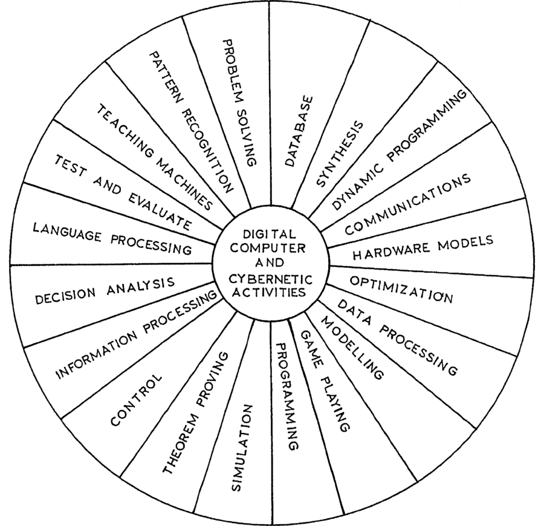
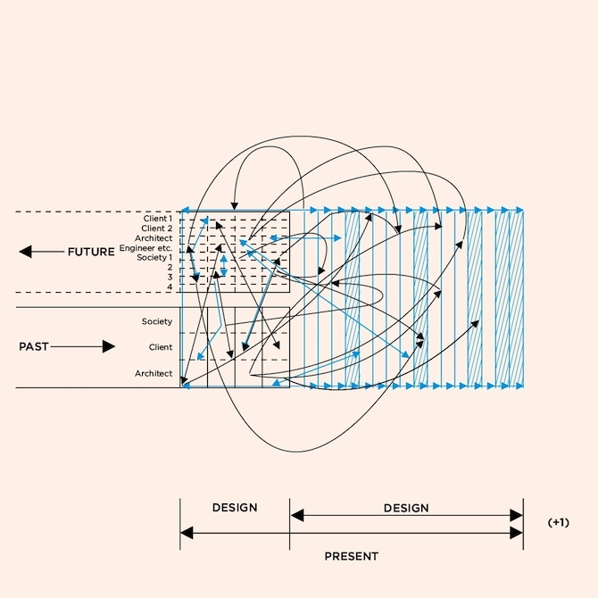
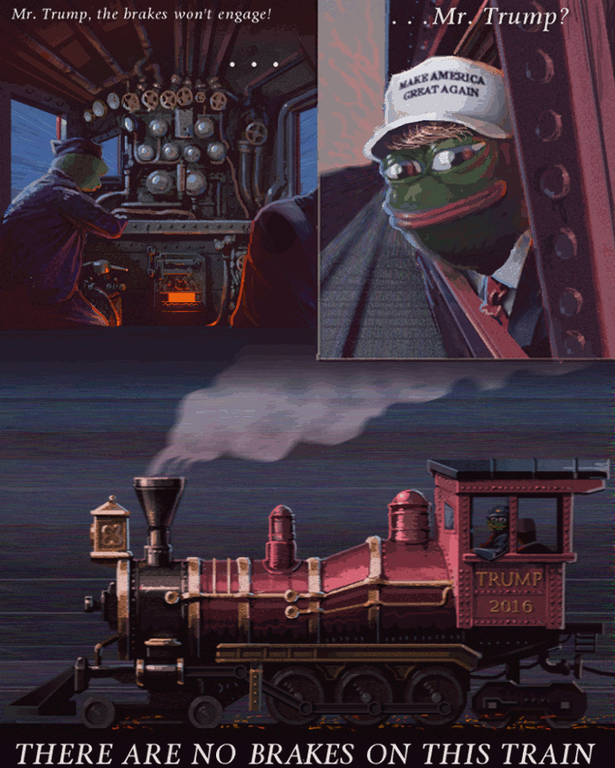

# Memes ⇒ Genes ⇒ Dreams
Von den Utopien des Internets.

    Keno Westhoff
    Arbeit zur Erlangung des Bachelor of Arts
    Hochschule für Künste Bremen
    2018

    Prof. Dennis Paul, Prof. Dr. Frieder Nake

## Inhalt

## Intro
> Ein Fluch dem Gotte, zu dem wir gebeten
> In Winterskälte und Hungersnöthen;
> Wir haben vergebens gehofft und geharrt,
> Er hat uns geäfft und gefoppt und genarrt –
>        Wir weben, wir weben!

*Aus Heinrich Heine: Die schlesischen Weber.*

## Danksagung

* Dennis Paul für das *Dynamische Archiv*
* Frieder Nake für die Empfehlung, Ernst Bloch zu lesen
* Ernst Bloch für die konkrete Utopie
* Slavoj Žižek für alles und so weiter und so weiter
* Lara Stumpf, `спасибо`!
* Frosti für flauschige Liebe
* Markus Walthert für seinen Dienst
* Eltern für die mentale Unterstützung
* Jürgen Amelung für die intellektuelle Unterstützung
* `pacman`-Developer-Team für den `pacman`-Code
* `#archlinux`-pacman (vor allem dem Menschen hinter dem Nickname `guys) 
* unbekannte Internethelfer\*innen

## Ort und Nicht-Ort
Die Utopie konstituiert sich anhand eines Ortes. Bereits beim Erfinder des Wortes, Thomas Morus, war *Utopia* die Insel der besseren, der perfekten Gesellschaft.  
Die Utopie konstituiert sich nicht anhand eines Ortes. Das Wort Utopia kommt aus dem Griechischen: οὐ (nicht) and τόπος (Ort).

> Bis dahin kann ich zwar nicht allem zustimmen, was dieser übrigens unbestritten hochgelehrte Mann von reifer Lebenserfahrung gesagt hat, doch gestehe ich ohne weiteres, daß ich sehr vieles von der Verfassung der Utopier in unseren Staaten eingeführt sehen möchte. Allerdings muß ich das wohl mehr wünschen, als daß ich es hoffen dürfte.[^1]
 
Für Morus sind die Beschreibungen Utopias unerreichbar weit weg, so dass sie eigentlich nur Träume sind und keinen realen Gehalt haben. Die Vorstellung existiert, die Umsetzung scheint zumindest momentan unmöglich. Die Utopie ist nicht kein Ort, sondern sie ist ein Nicht-Ort.
Slavoj Žižek beschreibt die Implementierung einer Utopie in die Welt als räumliches Unterfangen. 

> Utopia in this sense simply means: Do what appears within the given symbolic coordinates as impossible. Take the risk, change the very coordinates.[^2]

Die Änderung des Koordinatensystems als Bezug für die gesellschaftliche Struktur ist eine geradezu mathematische, geometrische Metapher für die Utopie. Insofern sieht Žižek die Utopie als Möglichkeitsraum, wobei laut Neomarxist Ernst Bloch nur etwas möglich ist, was in der Welt das Potential zur Umsetzung hat, somit eine Möglichkeit ist:

> Denkmöglich ist alles, wobei überhaupt etwas als in Beziehung stehend gedacht werden kann, doch darüber hinaus gilt für alle weiteren Arten des Kannseins: *Mögliches ist partiell Bedingtes*, und nur als dieses ist es möglich.[^3]

## Internet und Kommunikation
Schon der Begriff der Utopie ist, wie wir herausgefunden haben, ein Oxymoron, ein Widerspruch, der nicht aufgelöst werden kann. Ebenso das Internet ist gleichzeitig Ort und Nicht-Ort. Doch ist es auch ein Möglichkeitsraum? In den Anfangstagen des Internets wurde es noch Cyberspace genannt, ein Ort, durch den wir steuern, segeln können, als stünden wir in der Tradition der alt-griechischen Seefahrer (κυβερνήτης). Der Cyberspace ist das neue Utopia, die Insel, die gleichzeitig überall und nirgendwo ist. Doch ist es so einfach, wie der Begriff es verspricht? Können wir durch den Cyberspace segeln, während wir hier und da mit einer Utopie die Welt verbessern?  
Im Deutschen sind wir *im Internet*[^4] drin, im Englischen schweben wir *on the Internet*[^5]. Gemessen an der Verheißung des Internets ist die deutsche Bezeichnung treffender; es ist die neue Insel der Hoffnung. Als virtueller Ort bietet das Internet viel Raum für Utopien, die ebenfalls virtuell repräsentiert werden. Im Internet gibt es viele Utopien. Im Nicht-Ort-Ort gibt es viele Nicht-Ort-Orte. Umfassend betrachtet, besteht die Utopie des Internets darin, ein Inkubator für Utopien zu sein.[^6] Eine Meta-Utopie, die alle ihre Emporkömmlinge umfasst und ihnen fruchtbaren Grund bietet:

> But the really important point is something else: beyond the literary context of lived adventures, the central aspect of possible applications is in the concrete modeling of everyday environments which are not more than variants of the world we actually live in. In other words, this sort of modeling by means of planned variations of artificial worlds contributes to what we may call “experimental philosophy” in the sense of creating scenarios according to theoretical principles and drawing conclusions about their feasibility in practice.[^7]

Experimentelle Philosophie klingt schön, denn diese Aufteilung ist bereits aus der Naturwissenschaft bekannt: die experimentelle und theoretische Physik. Der Begriff, so eigenwillig er auch sein mag, hat zunächst eine positive Konnotation, die nicht ganz unberechtigt ist. Es ist wohl kein Zufall, dass bereits die Hippies ein Werkzeug zur Verbesserung der Gesellschaft in den Computern sahen: Steve Jobs war Hippie, als er Apple gründete.[^8] Steward Brand, Autor des Gegenkultur-Standardwerks *Whole Earth Catalog*, gründete das Netzwerk *The WELL*, bei dem es heute noch in der Beschreibung heißt: „The WELL is a cherished destination for conversation and discussion.“[^9] Eine liebere, freiere Welt versprachen sich die Hippies von Computern und vom Internet. Bewusstseinserweiterung durch Computer statt durch Rauschmittel: „Stewart Brand sieht Technologie als Erweiterung des menschlichen Intellekts.“[^10] Die Hippies sahen die Computer nicht als kühle Maschinen, sondern vielmehr als ein Werkzeug der Erkenntnis, der Innovation, der Liebe. Dort fängt die spirituelle und religiöse Deutung der Technologie an.  
Martin Heideggers Kritik weist uns darauf hin, dass Technik und Natur nicht so holistisch ineinandergreifen, wie es die Hippies vermuteten: 

> Das Wasserkraftwerk ist nicht in den Rheinstrom gebaut, wie die alte Holzbrücke, die seit Jahrhunderten Ufer mit Ufer verbindet. Vielmehr ist der Strom in das Kraftwerk verbaut. Er ist, was er jetzt als Strom ist, nämlich Wasserdrucklieferant, aus dem Wesen des Kraftwerks.[^11]

Die Technik nutzt die Natur aus und reduziert sie auf eine Funktion. Von Symbiose kann laut Heidegger keine Rede sein.
Sicherlich können viele Kommunikationsvorgänge im Internet stattfinden, die in der materiellen Welt nicht ohne Weiteres möglich sind. Das Finden von Tutorial-Videos über jede erdenkliche Tätigkeit, von Leuten, die die eigene Subkultur teilen, von einem *Secret Santa*[12]. Das alles sind Beispiele für wunderbare Geschehnisse, die über das Internet koordiniert werden. 

> Doch bei allem Optimismus der Cyber-Utopisten ist der digitale Bereich beträchtlich weniger „himmlisch“, als uns manche seiner Verfechter glauben machen möchten. Es stimmt zwar, daß der Cyberspace Interaktionen zwischen Menschen möglich macht, die normalerweise im physischen Leben keinen Kontakt haben würden, aber es gibt immer wieder Hinweise, daß diese gesellschaftliche Nivellierung nicht so allgemein ist, wie oft behauptet wird. Kurz, es ist alles andere als klar, ob die Himmelstür zum Cyberspace wirklich allen gleichermaßen offensteht.[^13]

Viele dieser negativen Aspekte des Internets lässt Zimmermann allerdings aus. Dass das Internet und seine sozialen Strukturen gar nicht so inklusiv sind wie erhofft, erörtert Margaret Wertheim im Vergleich mit der historischen Kaffeehauskultur:

> Es gibt da eine faszinierende historische Parallele, die ein bißchen Licht auf die Zukunft des Cyber-Utopismus werfen könnte. Die Analogie scheint vielleicht überraschend, aber der Literaturwissenschaftler Brian Connery hat gezeigt, daß sich viele Merkmale des neuen Cyber-Utopismus in den ersten europäischen Kaffeehäusern des 17. Jahrhunderts ähnlich angekündigt haben. Diese frühen Kaffeehäuser boten wie der Cyberspace einen neuen gesellschaftlichen Raum, in dem sich die Menschen über die Klassenschranken hinweg mischen konnten, so daß Adlige und Kaufleute miteinander in Berührung traten. Die Kaffeehäuser, sagt 
> Connery, konnten auch als „Reinkarnationen“ der klassischen Agora gesehen werden. In dieser Hinsicht stellten sie eine Art von utopischem sozialen Experiment dar, das, wie der Cyberspace, die Verheißung einer egalitären Gesellschaft für alle in Aussicht stellte. Wenn wir den Cyberspace und seine Möglichkeiten als einen utopischen gesellschaftlichen Raum betrachten, liefert die Geschichte der Kaffeehäuser eine aufschlußreiche Fallstudie.
> Innerhalb dieser neuen Kaffeehauskultur kam es weniger auf Reichtum oder Titel an als auf Schlagfertigkeit und ein schnelles Erfassen der neusten Nachrichten. Wie heute im Cyberspace waren aktuelle Informationen ein Schlüsselartikel, und nachdem 1665 die erste Zeitung gegründet worden war, wurden die Kaffeehäuser die wichtigsten Orte für die allgemeine Verbreitung von Nachrichten. Nach der Einrichtung allgemeiner Postdienste um 1680 wurden die Kaffeehäuser auch die gegebenen Stellen für die Ablieferung der Post. Davor waren Briefe durch Boten geschickt worden, und nur die Reichen konnten sich so etwas leisten. Durch die Bereitstellung eines öffentlichen Ortes für die Verbreitung von Nachrichten und Briefen erfüllten Kaffeehäuser eine ähnliche gesellschaftliche Funktion wie heute das Internet mit seinen Online-Nachrichtendiensten und seiner elektronischen Post. „Laboratorien für Experimente“ mit vielen der Freiheiten, die später in jenem Jahrhundert in Gesetze und Verfassungen gefaßt werden – darunter „Pressefreiheit, Versammlungsfreiheit und Redefreiheit“.
> Doch die echt demokratisierenden Trends, die die Kaffeehäuser geöffnet hatten, erwiesen sich als kurzlebig. Von Anfang an protestierten Andersdenkende gegen die Vermischung der Klassen, die da geschah, und tatsächlich war etwas sehr Dubioses an einem Ort, an dem, wie es ein Polemiker des 17. Jahrhunderts ausdrückte, „ein ehrenwerter Rechtsgelehrter und ein wandernder Taschendieb“ sich gleichberechtigt begegnen konnten. Aber es waren nicht nur äußere Kräfte, die gegen den egalitären Geist der Kaffeehäuser arbeiteten; auch interne Kräfte spielten eine Rolle bei seinem Ableben. Hier enthält die Geschichte des Kaffeehauses, sagt Connery, „eine potentielle Warnung für diejenigen, die davon träumen, daß das Internet utopische Diskussionsgemeinschaften schaffen werde.“
> Vor allem zwei Kräfte arbeiten gegen de neuen egalitären Geist: die „Wiederherstellung von Autorität“ und die „Errichtung von Exklusivität“. Beide können uns heute für den Cyberspace eine Lehre sein. Theoretisch konnte jeder bei einer Diskussion im Kaffeehaus sprechen – prinzipiell waren alle Stimmen gleich –, aber praktisch wurden diese Häuser meist von den Stimmen weniger oder sogar nur eines Star-Redners beherrscht. Statt solches Verhalten zu verurteilen, nutzten die Besitzer die Stars „als Attraktion für andere Besucher“, eine Strategie, die, wie Connery bemerkt, ziemlich dieselbe ist wie die von heutigen „Onlinediensten, die mit der Beteiligung von Stars aus Hollywood oder aus der Musikindustrie werben.“[^14]

Die Exklusivität scheint ein von den Menschen angestrebtes Merkmal zu sein, um sich über andere stellen zu können – auch in intellektuellen Diskursen. Gewarnt wird oft vor der Machtstellung einer Elite im Internet, weil diese als Oligopol mehr Kapital und Wissen agglomeriert, als es den übrigen Teilnehmer\*innen des Internets strukturell möglich ist:

> Schauen wir uns die proletarische Position im Internet an. Es ist klar, wer das Internet kontrollieren will. Besorgniserregend ist die massive Re-Privatisierung globalen Raumes durch das Cloud Computing. Anstelle großer Computer mit allen Daten haben wir nur individuelle Maschinen (PCs, iPhones), die wir – mit begrenztem Zugriff – miteinander verbinden können. Die tatsächliche Macht liegt dann irgendwo da draußen. Natürlich ist das auf gewisse Weise ganz nett. Wir haben sofortigen Zugriff auf Filme etc. Alles wird auf diese Weise abrufbar, aber nur über eine Firma, der alles gehört: Software und Hardware, Inhalt und Computer. Die Frage ist: Was ist dieses Alles? Alles wird zensiert werden. Cloud Computing ermöglicht also dem Nutzer einen ungekannten Reichtum an Möglichkeiten, aber diese Freiheit wird durch die Wahl des Providers bestimmt, dem gegenüber wir immer weniger Freiheiten haben.[^15]

Diese Exklusivität ist nicht das einzige Problem des Internets. Wahre Boshaftigkeit und wahrer Hass machen den Austausch im Netz noch unwirtlicher:

> Auch der Cyberspace ist ein selbstgemachter Innenraum, ein Raum, in dem die übelsten Seiten des menschlichen Verhaltens nur zu leicht gedeihen können. In den vergangenen Jahren haben Neonazi- und Skinhead-Sites im Internet wuchern können, und Usenet-Gruppen machten es Rassisten und intoleranten Menschen leicht, ihre Haßbotschaften zu verbreiten. Wer durch solche Sites mit ihren offen gewalttätigen, unsozialen und antidemokratischen Ausfällen surft, steigt wirklich in einen neuen Kreis der Hölle hinab.[^16]

Dieser Kreis der Hölle ist bis dato riesig geworden. Flamewars, Shitstorm, Doxxing, alles Wörter, die erst im Zusammenhang mit den sozialen Dynamiken des Internets entstanden sind. Auf Facebook treffen linke und rechte Fronten aufeinander, auf YouTube mobben Trolle andere Zuschauer\*innen, auf 4chan wird die Intoleranz und der Faschismus geprobt.  
Im Internet wird eine rassistische, frauenfeindliche Einstellung, die ein Mensch in der physischen Welt hat, nicht plötzlich verschwinden. Die Prägung eines Menschen wird erst einmal nicht verändert, nur weil er an Kommunikationsprozessen via Datenstrom teilnimmt.  
Zimmermann geht jedoch in seinem Text so weit, das Internet als Sandbox für Blochs konkrete Utopie zu bezeichnen:

> Indeed, Bloch’s striving for a concrete utopia is not very different from the traditional search for “pearly gates of cyberspace,” as Margaret Wertheim has called her recent book on the human tendency toward parallel realities.[^17]

Genau das Gegenteil ist der Fall. Bloch sieht eine konkrete Utopie als ein Konzept, das Schritt für Schritt Anwendung in der Realität finden kann:

> Konkrete Utopie steht am Horizont jeder Realität; reale Möglichkeiten umgibt bis zuletzt die offenen dialketischen Tendenzen-Latenzen.[^18]

Er sieht also eine Überführung des *Virtuellen aber Möglichen* in die materielle Welt vor. Blochs Konzept der konkreten Utopie enthält kein fantastisches Moment, der Cyberspace als Paradies jedoch schon. Die konkrete Utopie ist vielmehr ein transformativer Prozess. Das Elegante an Blochs Theorie ist die Schaffung besserer Zustände auf Erden, währenddessen das Christentum und der Cyberspace im Abstrakten, Nicht-Materiellen bleiben. „Besser ist es woanders.“ Oder um es in Blochscher Weise auszudrücken: Die Utopien des Christentums und des Cyberspace sind zwar denkmöglich, aber nicht real möglich – insofern sind sie nicht mehr als Tagträume.  
Von einer Sandbox kann ebenfalls nicht die Rede sein. Dann hätte die Kommunikation Internet keine Auswirkung auf das Denken der teilnehmenden Personen. Menschen, die miteinander kommunizieren, sind aber immer emotional von den Geschehnissen betroffen. Wenn jemand einen Menschen beleidigt, wird es nicht dadurch besser, dass er es über das Telefon oder das Internet tut. Die Hürde zu extremen Ausfällen ist wegen der emotionalen Distanz und Anonymität aber umso geringer.  
Dies alles sind die Symptome des Übels im Internet. Was ist die Wurzel dieses Übels?

## Materie und Daten
Die Wurzel ist die Transzendenz und eine übersteigerte Rationalität, denn die Trennung zwischen Cyberspace und materiellem Raum wird von den meisten Verehrer\*innen des Internets in noch viel radikalerer Form vertreten:

> Egal welches Chaos und welche Ungerechtigkeit auf Erden herrschten, nach dem Tod würden diejenigen, die Jesus folgten, sich auf eine ewige Stätte des Glücks freuen können.
> So bieten auch in unserer Zeit des gesellschaftlichen und ökologischen Zerfalls – einer Zeit, wo unser „Weltreich“ sich ebenfalls aufzulösen scheint – die heutigen Werber für den Cyberspace ihrer Domäne als ein idealisiertes Reich „oberhalb“ und „jenseits“ der Probleme einer geplagten materiellen Welt an. Genau wie die frühen Christen versprachen sie einen transzendenten Zufluchtsort – eine utopische Stätte der Gleichheit, Freundschaft und Macht.[^19]

Die Transzendenz des Internet bedeutete, ein Leben jenseits der weltlichen, materiellen Umstände könnte dort stattfinden: „[…] I come from Cyberspace, the new home of mind.“[^20] Anstelle des Todes, als Moment, in dem die Seele in den Himmel auffahren kann, stehen nun ein Computer und ein Kabel; der Tod und der Computer sind beides Interfaces des besseren Lebens. Das Warten auf das Paradies wäre damit beendet. Was erwartet uns im Cyberspace-Paradies? Es verspricht uns einen Ort, an dem nur die „Information“, losgelöst von der irdischen Materie, herrscht. Behalten wir einen Moment den Gedanken der Immaterialisierung im Kopf und lesen den Tag des jüngsten Gerichts in der Bibel nach:

> Es werden Zeichen sichtbar werden an Sonne, Mond und Sternen und auf der Erde werden die Völker bestürzt und ratlos sein über das Toben und Donnern des Meeres. Die Menschen werden vor Angst vergehen in der Erwartung der Dinge, die über den Erdkreis kommen; denn die Kräfte des Himmels werden erschüttert werden. Dann wird man den Menschensohn in einer Wolke kommen sehen, mit großer Kraft und Herrlichkeit. Wenn dies beginnt, dann richtet euch auf und erhebt eure Häupter; denn eure Erlösung ist nahe. (Lukas 21, 25–28)

Gott besteht aus Zahlen und ist die Wurzel der Welt.
Der Technikoptimismus ist aus diesem Grund ein Euphemismus für eine Religion. Engels mahnt uns, es habe gar keinen Sinn, sich von der materiellen Welt zu lösen. Die Befreiung von der materiellen Welt ist nicht aussichtsreich, ihre Existenz ist eine Notwendigkeit:

> Hegel war der erste, der das Verhältnis von Freiheit und Notwendigkeit richtig darstellte. Führ ihn ist die Freiheit die Einsicht in die Notwendigkeit. „Blind ist die Notwendigkeit nur, insofern dieselbe nicht begriffen wird.“ Nicht in der geträumten Unabhängigkeit von den Naturgesetzen liegt die Freiheit, sondern in der Erkenntnis dieser Gesetze, und in der damit gegebnen Möglichkeit, sie planmäßig zu bestimmten Zwecken wirken zu lassen.[^21]

Die Freiheit von Notwendigkeit ist deshalb nur eines: ein Traum. Ein Traum ist an sich nicht verwerflich – die Kunst ist ein großer Traum –, wir sollten uns dabei aber wohl bewusst sein, dass wird uns der Notwendigkeiten außerhalb des Traumes nicht entledigen können. Der Träumer\*innen des Cyberspace glaubten daher an die vollwertige gesellschaftliche Struktur des Internets. John Perry Barlow schrieb in „A Declaration of the Independence of Cyberspace“ von der Nichtherrschaft des Staates im Cyberspace:

> Governments derive their just powers from the consent of the governed. You [the governments] have neither solicited nor received ours. We did not invite you. […] Cyberspace does not lie within your borders. […] We are forming our own Social Contract. […] Your legal concepts of property, expression, identity, movement, and context do not apply to us. They are all based on matter, and there is no matter here.[22]

Ein\*e Kontraktualist\*in kann das Konzept Barlows nur ablehnen. Wer ist nun wirklich Teil der Cyberspace und wer nicht? Wie soll jemand zwei Staaten angehören, dem territorialen Staat und dem Cyberspace? Das sogenannte Cyberspace-Manifesto kann, positiv gedeutet, eher als eine interessante Fiktion mit Leerstellen gesehen werden, die Anreize setzt, über Freiheit im Internet und „informationelle Selbstbestimmung“ (wie das Bundesverfassungsgericht das Grundrecht über die eigenen Daten nennt) nachzudenken. Wie soll dieser Gesellschaftsvertrag funktionieren oder gar durchgesetzt werden? Lebt die Vorstellung davon, dass der Volkswille *a priori* determiniert ist, wie Jacques Rosseau davon in seiner Demokratietheorie ausgeht? Wie „property, expression, identity, movement and context“ plötzlich keine Bedeutung mehr haben, deutet auf ein Leben ohne Körper hin, ein rein virtuelles Leben. Das Netz besteht sehr wohl aus Materie, Daten sind nur mit Materie möglich, wie Einstein uns mit seiner Speziellen Relativitätstheorie lehrt; und diese Materie gehört auch irgendjemanden. Die Gesellschaftsbildung über das Netz ist bis heute ein Rahmen, zu dem Menschen gerne Konzepte entwickeln. Mit Aufkommen der Blockchain gründete Susanne Tarkowski Tempelhof Bitnation als Staat eine Rechtssprechung, die nur in der Blockchain existieren. Gleichzeitig lehnt sich Bitnation gegen die Souveränität jedes existierenden Staates auf, ohne das explizit zu äußern. Gerichtsurteile werden dort von Computern gefällt. Jurist*innen wissen, dass Rechtssprechung kein algorithmischer Prozess ist. Aus den Unschärfen des Rechts eine kluge, aber nachvollziehbare Entscheidung zu treffen ist eine menschliche Aufgabe. Computer sind dafür nicht geeignet. Schon ein einfacher Wahlprozess ist nicht von Computern zu bewerkstelligen, da er nicht transparent und nachvollziehbar ausgeführt werden kann. Eine Wahl über das Internet wäre dementsprechend noch verheerender. Der Staat per se ist kein algorithmisches Unterfangen, sondern eine Angelegenheit seiner Bürger\*innen oder Citoyens.  
Das heißt nicht, dass Staaten für immer nationale Gebilde bleiben müssen. Dennoch müssen sie eine Legitimität und eine Durchsetzbarkeit haben. Ein algorithmisches Gebilde reicht da nicht und entwickelt sich wahrscheinlich zum Gegenteil von dem, was die Gründerin mit ihren libertären Ziele bewirken möchte. Dass die Bitnation durchaus nicht souverän ist, zeigt sich am Unternehmenssitz. Obwohl die Entwickler\*innen aus Berlin kommen, ist der Sitz in der Schweiz, weil die Schweiz die liberalsten Gesetze für solche Experimente bietet. Der Staat im Staate ist kein Staat, vor allem wenn er nicht einmal grundsätzlich die Bedingungen für eine Konstitution erfüllt.
Was erhoffen die Gründer\*innen sich von diesem Konstrukt? 

> I personally set out on this path because I wanted to see a world of thousands or millions of competing borderless governance providers competing through offering better services, which frees people from the ‘one-size-fits-all’ coercive model we’re currently living. There’s been very little innovation in government since its invention, because it’s a global oligopoly enforced by violence. […] For one, racism, sexism, classism and violence generally decrease when people aren’t arbitrarily being forced to live with people they don’t like. […] Bitnation has developed services, infrastructures and insurances with the help of the blockchain technology that are better quality than what exists in today’s nation state governance and where citizens have more agency. I’m not saying that government services are inherently bad, it’s the way they’re enforced, the micro-managing of people’s lives, the regulations on everything. The global Bitnation network holds states accountable and gives citizens their power back through providing voluntary peer-to-peer governance alternatives.[^23]

Die konkreten Auswirkungen ihrer virtuellen Regierung findet Tarkowski Tempelhof noch fantastischer:

> When we enhance finance mobility through tools like Bitcoin, there will be far less terrorism. Bitnation will also massively reduce poverty through free trade, asset registration and financial fluidity. Mental health issues will decrease because we won’t be coerced into living by rules we don’t agree with. War and genocide will become much less possible because there will be no authority who can select a proportion of the population and declare it a ‘non subject’.[^24]

Die Techno-Libertären haben ihre ideologischen Wurzeln in der Kybernetik, ob bewusst oder unbewusst. Entwürfe wie die von Barlow oder Tarkowski Tempelhof gehorchen den kybernetischen Regeln. Es zeigt sich: Die Kybernetik ist nicht nur eine parallele Strömung, sondern eine parallele Realität, die in die primäre Realität eingebettet wird und mit ihr wechselwirkt [sic!]. Die Kybernetik überträgt ihre Ideologie auf andere Denkschulen, deren Ergebnisse wiederum die Kybernetik stärken. Die Kybernetik ist die ideologische Wurzel für das Übel im Internet.  

Quelle: <https://www.are.na/block/161026>.

Nach den Kybernetikern funktioniert die Welt wie ein gigantischer elektrischer Schaltkreis, alles ist von zwar komplexen, aber mit ausreichend Rechenleistung berechenbaren Regelkreisen (Inputs und Outputs) determiniert.  
Douglas Adams schildert in seinem zukunftsweisenden Roman Per Anhalter durch die Galaxis die Erde als Computer der Mäuse, um die Frage nach dem Leben, dem Universum und dem ganzen Rest zu errechnen. Die Kybernetiker\*innen sehen sich als die Mäuse, die mit ihren rechnenden, fälschlicherweise Elektronenhirn genannten Computern die Welt besser erklären können, als es mehrere tausend Jahre Philosophie und Wissenschaft je konnten. Alle, die behaupten, es gebe keine absolute Wahrheit, lügen, denn die Wahrheit ist berechenbar – das ist der einzig folgerichtige Schluss der Kybernetik. Das Internet kam da wie gerufen.  
Endlich hat die Parallelstruktur eine physische Repräsentation bekommen. Kabel, Switches, Terminals, durch die die Daten (sie nennen sie *Information*) dieser Welt fließen. Weil in der Kybernetik sich alles durch richtige Steuerung so einrichten lässt, wie es gewünscht wird, war das Internet die Rettung der Welt – ein Netzwerk, das ausreichend Daten (*Information*) von A nach B übermitteln und verrechnen konnte. Der elektrische Schaltkreis war geschlossen.  
Staatstheorie lässt sich daher ganz einfach mit kybernetischen Prinzipien betreiben. Die DDR ist laut Wolfgang Ernst daran gescheitert, dass sie eben keinen geschlossenen Schaltkreis hatte:

> Tatsächlich läßt sich die von Foucault bemerkte Differenz beider Systeme in Begriffen der Kybernetik, des geschlossenen und offenen Schaltkreises beschreiben. Zwar beruft sich der wissenschaftliche Sozialismus – und hier liegt sein Flirt mit der Kybernetik vor allen in den 60er Jahren (Walter Ulbricht, Georg Klaus) –, auf die Vorstellung, gesellschaftliche Prozesse und deren Veränderung steuern zu können. Doch diese Verfügbarkeit scheitert an mangelndem feedback. Rückkopplung meint allgemein die Beeinflussung eines Geschehens durch Rückwirkung der Folgen auf den weiteren Verlauf, speziell Regelvorgänge in der Informations- und Kommunikationstheorie.[^25]

Heißt das, die Planwirtschaft der DDR hätte funktioniert, hätte das Regime nur mehr Rückkanäle gehabt? Ulbricht, Honecker, ihr hättet die DDR nur ans Internet anschließen müssen![^26] In Chile probten die Sozialist\*innen den wissenschaftlichen Sozialismus. Stafford Beer, Begründer der Managementkybernetik, wurde eingeladen, den Control Room im Rahmen des Projekts Cybersyn zu planen und bauen. Dort sollten alle aktuellen gesellschaftlichen, wirtschaftlichen Daten eingehen und grafisch für die Regelnden und Herrschenden dargestellt werden. Insofern verweist der, nennen wir ihn ruhig so, kybernetische Sozialismus auf ein ganz andersartiges Herrschaftsmodell: dem *Leviathan* von Thomas Hobbes. Der Leviathan steht für den Herrscher, der alles überblickt und gerecht mit Augenmaß entscheidet. Der Schutz der Bevölkerung geht vom Herrscher aus, dafür muss die Bevölkerung dem Leviathan die Herrschaft anvertrauen. Die Sicherheit wäre in dem von Hobbes geprägten Naturzustand nicht gegeben. Im Naturzustand gilt das Recht des Stärkeren, jede\*r ist für sich selbst verantwortlich. Mord, Körperverletzung und Diebstahl würden dementsprechend nicht geahndet werden. Insofern war der Leviathan bereits ein politischer Fortschritt, aber heutzutage umso mehr ein veraltetes Model. Die Monarchie und gerade die Diktatur sind ideologisch und herrschaftstheoretisch durchgespielt, das will wirklich keiner mehr. Demokratische Teilhabe ist das Mindeste, was ein zeitgemäßes Herrschaftsmodell erfüllen muss. Der kybernetische Sozialismus tut dies aber gerade nicht: Er überlässt die „Regelung“ der Wirtschaft einer Elite, die im Geheimen, wohlmöglich ohne demokratische Legitimation, arbeitet. Dass sich eine Wirtschaft über eine gezwungenermaßen mehr oder weniger willkürliche Ansammlung an Daten steuern lässt, ist offensichtlich ein Hirngespinst. Soweit die Theorie. In der Praxis was Allendes Control Room nur eine Attrappe. Die Displays zeigten Platzhaltergraphen an. Mit Echtzeitdaten, einem Stream, hatte das nichts zu tun. In Betrieb genommen wurde dieser Raum auch nie. Das Militär stürzte das sozialistische Regime unter Allende mit der Unterstützung der CIA.[^27]. 
Die US-amerikanische Regierung wurde allerdings auch von Kybernetik beeinflusst, wenn auch nicht so offensichtlich wie in Chile: FED-Chef Alan Greenspan empfahl dem damaligen US-Chef Bill Clinton auf computergestützten Börsenhandel umzusteigen, das würde Wirtschaftskrisen auf ewig verhindern.[^28] Den Traum vom radikal wachsenden Kapitalismus sollte nichts mehr aufhalten können. Diese Hoffnung wurde nicht erfüllt. Der *Club of Rome* hat der Welt den Dienst erwiesen, sich mit den schwindenden Ressourcen des Planeten Erde auseinanderzusetzen. Aber auch sie benutzen kybernetische Modelle, um die Welt in der Zukunft zu simulieren. Positiv zu erwähnen ist, dass die Klimamodelle immer auch als solche bezeichnet werden. Niemand behauptet, diese könnten mit Sicherheit die Zukunft vorhersagen. Der kybernetische Geist lässt sich gesellschaftlich noch überall verorten, auch wenn er nicht explizit sichtbar gemacht wird oder als solcher bezeichnet wird.

Quelle: <https://www.are.na/block/530498>.

Unser Denken wird mit den Metaphern der Elektrotechnik beschrieben, der Computer mit Metaphern des Denkens. Nun kann erst einmal davon ausgegangen werden, dass Metaphern nicht schädlich sind. Niemand glaubt, dass ein Tisch menschliche Beine hätte und durch den Computer Einsen und Nullen (wie in der Semsamstraße, mit kugelrunden Äuglein) flössen. Allerdings haben sich die technikgläubigen und kybernetischen Metaphern so sehr in den Wortschatz eingebrannt, dass sie ihren metaphorischen Gehalt verloren hat. Wenn Computer *künstlich intelligent* sind, sollen die plötzlich denken. Die sogenannte Quantifizierung und das *quantified self* sind der Versuch, das persönliche Leben und die individuelle Aktivität in Daten zu fassen. Die offensichtlichen Anwendungsfälle stellen da ein geringes technisches Problem dar: Die Zeit, die jemand für seine oder ihre Joggingrunde braucht, in der jemand schläft, die Körpergröße, das Alter ist ausreichend aufzeichenbar, weil es sich augenscheinlich um diskrete Werte handelt. Allerdings gibt es auch hier radikalere Ansätze, die das ganze Leben in Zahlen verwandeln wollen. Die Frage ist, welche qualitativen Erkenntnisse wir aus den Quantifizierungen gewinnen können. Einfacher ausgedrückt: Was sagen uns die Zahlen? Aber genau weil wir alle in diesen Gedankenbildern gefangen sind, sind wir so anfällig für techno-zentristische Religionen wie die Kybernetik. Heidegger weist uns darauf hin, dass ein techno-zentristischer Blick zu Fehlschlüssen führt:

> Im Weltalter der Technik ist die Natur keine Grenze der Technik. Die Natur ist da vielmehr das Grundbestandstück des technischen Bestandes – und nichts außerdem.[^39]

Die Natur ist in der Kybernetik nur noch ein Untergeordnetes. Bei den Kybernetiker\*innen funktioniert die Natur wie die Technik:

> The central nervous system no longer appears as a self-contained organ, receiving inputs from senses and discharging into the muscles. On the contrary, some of its most characteristic activities are explainable as circular processes, emegerging from the nervous system into the muscles, and re-entering the nervous system through the sense organs, whether they be proprioceptors or organs of the special senses.[^31]

Der Körper wird ausschließlich als informationsverarbeitendes System betrachtet. Ökologische sogenannte Systeme werden als selbststabilisierende Kreisläufe betrachtet – empirisch wurde das Gegenteil bewiesen. Das Chaos der Natur lässt sich nicht wegträumen. Die Regeltechnik darf dort bleiben, wo sie hingehört: in den SIPART DR von Siemens[^32] und ins Heizungsthermostat.
Die Technik überrollt den Menschen mit ihren intrinsischen Eigenschaften und verändert das Denken der Menschen.

> Die Bedrohung des Menschen kommt nicht erst von den möglicherweise tödlich wirkenden Maschinen und Apparaturen der Technik. Die eigentliche Bedrohung hat den Menschen bereits in seinem Wesen angegangen. Die Herrschaft des Ge-stells droht mit der Möglichkeit, daß dem Menschen versagt sein könnte, in einem ursprünglicheres Entbergen einzukehren und so den Zuspruch einer anfänglicheren Wahrheit zu erfahren.[^33]

Schon gar nicht ist die Technik alleine, eine Utopie, die sich wie die Büchse der Pandora von selbst entfaltet und die Welt von ihrem Elend befreit:

> Sinnlos daher, von Erfinden, das für sich allein steht, ein sicher Gutes zu erwarten. Es ist nicht immer besser als die Gesellschaft, die es setzt und gebraucht, wenn es auch viel mehr Übernehmbares als diese enthält. Jubel über große technische Fortschritte ist allemal nichtig, wenn die Klasse und der Zustand der Klasse nicht mitgedacht werden, für die die Wunder geschehen.[^34]

Es sollte also auch bei der Kybernetik gefragt werden: Qui bonum? Wem nützen diese Theorien? Den Vertreter*innen der *Californian Ideology* auf jeden Fall. Ihre Technik-Startups haben das Potential, zum wertvollsten Unternehmen der Welt zu werden, siehe Apple, Google und Facebook.
Macht die Kybernetik diejenigen mächtiger, die es wissen, Maschinen zu bedienen und Algorithmen zu verstehen? Die Kybernetik scheint nicht gesellschaftlich inklusiv, sondern bewusst auf Eliten ausgerichtet zu sein, die die Regelkreise überblicken und kontrollieren. Genauso wie der christliche Gott es tat, der, wie wir am Anfang dieses Texte herausgefunden haben, wohl der erste Kybernetiker war.

> Im Anfang erschuf Gott Himmel und Erde. Die Erde war wüst und wirr und Finsternis lag über der Urflut und Gottes Geist schwebte über dem Wasser. Gott sprach: Es werde Licht. Und es wurde Licht. Gott sah, dass das Licht gut war. (1. Mose 1,1)

Mit der Kybernetik haben Forscher*innen es vermutlich zum ersten Mal geschafft, eine esoterische Konzeption großflächig als anerkannt akademische Wissenschaft zu etablieren und dabei die Regeln des Empirischen in ihrer Arbeit zu brechen.
Was ist das Besondere an der kybernetischen Esoterik und Spiritualität im Gegensatz zu sonstigen esoterischen Strömungen, die viel eher als solche abgetan werden? Der Trick ist, Technikgläubigkeit und Hyperrationalität als religiöses Moment zu gebrauchen. Eine solche gedankliche Konstruktion steht weniger im Verdacht, ein irrationales Glaubenssystem zu konstituieren.

> To predict the future of a curve is to carry out a certain operation on its past.[^35]

Das klingt im Aristotelischen Sinne logisch. Aber wie Kurt Gödel uns mit seinem Unvollständigkeitssatz zeigte, enthält jede Aussage Widersprüche. Die absolute Wahrheit gibt es nicht, Annäherung an Wahrheiten gibt es dennoch sehr wohl. Utopie ist deswegen auch Wahrheitsfindung und daraus folgend ein Risiko:

> Take the risk, change the very coordinates. […] The point is about practicing [the utopias].[^36]

Wie Žižek sagt, gibt es immer ein Risiko bei Utopien, das sie aber wert sind. Utopien mit eigentlich dystopischen Gehalt müssen nur rechtzeitig erkannt worden sein, bevor sie großflächig 
umgesetzt werden. 
Ganz wichtig: Übung macht den Meister. Wenn wir nur wenige anständige Utopien entwickeln, ist es kein Wunder, dass die Gesellschaft das Utopie-Produzieren verlernt. Die Angst vor der Utopie lähmt uns. Das von Francis Fukuyama proklamierte *Ende der Geschichte* mit der liberalen Demokratie und Kapitalismus sorgt unter anderem dafür, dass kein Interesse mehr an Utopien besteht.
Alle anderen Aussichten scheinen für Fukuyama radikal bedrohlich:

> Democracy’s only real competitor in the realm of ideas today is radical Islamism. Indeed, one the world’s most dangerous nation-states today is Iran, run by extremist Shiite mullahs.[^37]

Natürlich ist der radikale Islam offensichtlich keine gesellschaftliche Alternative. Allerdings taucht in seinem Absatz zwei Mal ein entscheidendes Wort auf: *today*. Was nicht ist, das kann werden. Diese Angst vor der Veränderung, vor der Utopie sorgt auch dafür, dass es keine Möglichkeiten im Blochschen Sinne gibt, die den gesellschaftlichen Fortschritt vorantreiben. Politiker\*innen wie Bernie Sanders in den USA werden deswegen sogar als Gefahr wahrgenommen. Es bedarf einer verstärkten Konzeption neuer Utopien auf der Welt, allerdings auch einem guten Sortiermechanismus, um zwischen wahrhaftig utopischem und versteckt dystopischem Gehalt unterscheiden zu können.

## Gene und Meme
Richard Dawkins hat sich einen Namen als Biologe und Atheist gemacht. Als solcher vertritt er die Theorie Charles Darwins zur Evolution. Allerdings vermutete er, dass nicht nur die rein biologischen und körperlichen Faktoren den evolutionären Mechanismen unterliegen. Auch die Kultur ist seiner Meinung nach mit der biologischen Entwicklung der Lebewesen vergleichbar. Kybernetiker nennt er sich nicht, mit der sogenannten Information, mit Rechenmaschinen oder Schaltkreisen hat er in seiner akademischen Arbeit nichts am Hute. Er prägt den Begriff Mem als eine Einheit Kultur. (Jedem bekannt vom Einkauf auf dem Wochenmarkt: „Ich hätte gerne zwei Kilogramm Kartoffeln und ein Mem Kultur“.)
Im Speziellen wird der Begriff Internetmem für Bilder, Texte, Töne verwendet, die sich exponentiell („viral“) verbreiten. Oft setzten sich Autoren in ihren internetkulturellen Werken mit der Ursprung des Wortes Mem auseinander, selten wurde es jedoch kritisch hinterfragt. Selbst wenn der Begriff Internetmem nur bildlich gemeint ist, trifft das Bild überhaupt ansatzweise zu?

> Beispiele für Meme sind Melodien, Gedanken, Schlagworte, Kleidermoden, die Art, Töpfe zu machen oder Bögen zu bauen. So wie Gene sich im Genpool vermehren, indem sie sich mit Hilfe von Spermien oder Eizellen von Körper zu Körper fortbewegen, verbreiten sich Meme im Mempool, indem sie von Gehirn zu Gehirn überspringen, vermittelt durch einen Prozeß, den man im weitesten Sinne als Imitation bezeichnen kann.[^38]

Inwieweit Dawkins diese Aussage metaphorisch oder buchstäblich meint, bleibt fraglich. Doch die Aussage eines Kollegen Dawkins ist umso eindeutiger:

> Wie mein Kollege N. K. Humphrey einen früheren Entwurf dieses Kapitels treffend zusammenfaßte, sollten „… Meme … als lebendige Strukturen verstanden werden, nicht nur im übertragenen, sondern im technischen Sinne.Wenn jemand ein fruchtbares Mem in meinen Geist einpflanzt, so setzt er mir im wahrsten Sinne des Wortes einen Parasiten ins Gehirn und macht es auf genau die gleiche Weise zu einem Vehikel für die Verbreitung des Mems, wie eine Virus dies mit dem genetischen Mechanismus einer Wirtszelle tut… Und dies ist nicht einfach nur eine Redeweise – das Mem etwas für ‚den Glauben an das Leben nach dem Tod‘ ist tatsächlich viele Millionen Male physikalisch verwirklicht, nämlich als eine bestimmte Struktur in den Nervensystemen von Menschen überall auf der Welt.“[^39]

Die Leute, die den Cyberspace, als eine transzendentale Destination sehen, übernahmen natürlich Elemente des christlichen Himmels, doch passiert dieser Prozess viel fließender als es bei Dawkins zur Geltung kommt. Das Mem als Radikal:

> Denken wir daran, daß „Überlebenswert“ hier nicht Wert für ein Gen im Genpool bedeutet, sondern Wert für ein Mem in einem Mempool. Die Frage heißt eigentlich: Was ist an der Vorstellung von einem Gott so Besonderes, das ihr in der kulturellen Umwelt ihre Beständigkeit und Wirksamkeit verleiht? Der Überlebenswert des Gott-Mems im Mempool ergibt sich aus seiner großen psychologischen Anziehungskraft. Es liefert eine auf den ersten Blick einleuchtende Antwort auf unergründliche und beunruhigende Fragen über das Dasein. Es legt den Gedanken nahe, daß Ungerechtigkeiten auf dieser Welt vielleicht in der nächsten ausgeglichen werden.[^40]
> Von einem einfachen Replikator, ob Gen oder Mem, kann man nicht erwarten, daß er auf kurzfristig erreichbare egoistische Vorteile verzichtet, selbst wenn sich dies auf lange Sicht tatsächlich auszahlen würde.[^41]

Das Mem ist nach Dawkins eine radikal egoistische Einrichtung, etwas, das sich nach den objektivistischen Regeln Ayn Rands verbreitet, ohne dabei ein Bewusstsein zu haben. Die Rede ist von den Gesetzmäßigkeiten der Evolution.

Das Besondere an Internetmeme ist gerade, dass die Autorenschaft keine Rolle spielt. Das Mem ist ein kollektives Phänomen. Kann ein Internetmem besser überleben als ein anderes Mem Dawkinscher Art? Eher nein, Internetmeme sind besonders kurzfristig. In den Anfangstagen der Internetmeme gab es die Rage Comics, Advice Animals, Success Kids; diese Phänomene spielen heutzutage keine Rolle mehr. Sie boten jedoch den Boden und den Dünger für eine rasche ästhetische Entwicklung und eine weitere Abstrahierung der Internetmeme. Im Gegensatz zur Vergangenheit sind diese Kunstwerke ephemer, die Ausdrucksweise des Postmodernismus. Ein richtiges Archiv gibt es dementsprechend nicht, abgesehen von Know Your Meme, dem mehr oder weniger verzweifelten Versuch, Internetmeme zu katalogisieren.
Vielleicht ist diese Kurzfristigkeit selbst ein kultureller Wert, der aus permanenter Mutation besteht:

> Die Reproduktionstechnik, so ließe sich allgemein formulieren, löst das Reproduzierte aus dem Bereich der Tradition ab. Indem sie die Reproduktion vervielfältigt, setzt sie an die Stelle seines einmaligen Vorkommens sein massenweises. Und indem sie der Reproduktion erlaubt, dem Aufnehmenden in seiner jeweiligen Situation entgegenzukommen, aktualisiert sie das Reproduzierte.[^42]

Die Mutation wird dabei durch die Mutation selbst am Laufen gehalten. Die ästhetische Produktion dient als Inspiration für weitere ästhetische Produktion:

> Das reproduzierte Kunstwerk wird in immer steigendem Maße die Reproduktion eines auf Reproduzierbarkeit angelegten Kunstwerks.[^43]

Vielleicht besteht Kultur gar nicht aus Inhalten, die leben und sterben, 
sondern aus einem kollektiven Prozess der Äußerung, der Kommunikation und des ästhetischen Verfassens. Die Internetmeme sind Bestandteil einer Subkultur, der vergeblich für Werbezwecke benutzt worden ist. Vielleicht ist es ein kultureller Wert, dass Internetmeme immer ein gewissen Untergrundcharakter haben müssen. Das macht Meme aber auch anfällig für subversive politische Approbation.

## Rechte und Technik
Die irrationale Hyperrationalität der Technikgläubigkeit im Allgemeinen und der Kybernetik im Speziellen machen sie ausnutzbar. Sie ermöglicht andere, sehr widersprüchliche Strömungen dort anzusetzen, wo die Kybernetik ihr nützlich sein kann. Zurück zu der Frage, die der Gedanke von Ernst Bloch aufgeworfen hat: Wem, welcher Klasse, nützt eigentlich die Kybernetik? Es sind nicht nur die Unternehmer\*innen des Sillicon Valleys, sondern auch Gruppierungen, von denen es auf den ersten Blick weniger zu erwarten wäre: Rechte und Neofaschist\*innen.
Die einzigen großen Utopie-Geber heutzutage sind Menschenhasser\*innen. Vor einigen Jahren waren sie noch nicht bedeutend. Da gab es die US-amerikanische Tea Party, die die konservative Revolution anstrebte und plötzlich ein paar Abgeordnete im Repräsentantenhaus hatte. Welch ein Schock das zu diesem Zeitpunkt war! 
Da gab es ab und an Neonazi-Demonstrationen in Europa. Da wurde der Front National und die FPÖ zu einer der stärksten politischen Kräfte in Frankreich und Österreich. Das waren die Anfänge für ein unglaubliches, unerwartetes Erstarken dieser politischen Rechten.
Ausgenutzt haben sie nicht nur eine gesellschaftliche Unzufriedenheit sondern auch technische Prinzipen. 
Peter Thiel, einer der Gründer von PayPal, ist schon seit dem Philosophie-Studium für seine libertäre Ansichten bekannt. 2009 schrieb er für den libertäre US-amerikanische Thinktank *Cato Institute*:

> […] I no longer blieve that freedom and democracy are compatible […] The 1920s were the last decade in American history during which one could be genuinely optimistic about politics. Since 1920, the vast increase in welfare benificaries and the extension of the franchise to women – two constituencies that are notoriously tough for libertarians […] have rendered the notion of “capitalist democracy” into an oxymoron.[^44]

Schon in diesem Artikel wird deutlich, wie Peter Thiel sich nicht nur gegen einen starken Staat wendet, sondern die Herrschaft des Volkes generell in Zweifel zieht. 
Die Herrschaft des Individuums über sich selbst ist das Ziel der Libertären mit Ayn Rand als Ikone des radikalen Individualismus. Um sich der staatlichen Gewalt zu entziehen, propagiert Thiel exo-staatliche Gebilde („outer space“, „seasteading“) – und das Internet:

> By starting a new Internet business, an entrepreneur may create a new world. The hope of the Internet is that these new worlds will impact and force change on the existing social and political order. The limitation of the Internet is that these new worlds are virtual and that any escape may be more imaginary than real. The open question, which will not be resolved for many years, centers on which of these accounts of the Internet proves true.[^45]

Der Techno-Libertarismus, der libertäre Transhumanismus, die *Californian Ideology*[^46] dienten als Grundlage für die freie Entfaltung der radikalen Rechten.
Im Präsidentschaftswahlkampf 2016 unterstützte Thiel dann Donald Trump, der weniger libertär, stattdessen protektionistisch und rechtspopulistisch agiert.[^47] 
Die Vermischung der Libertären mit der sogenannten Neurechten war mit Donald Trump als neuen US-Präsidenten perfekt, nicht nur in den Vereinigten Staaten. 

Die Freiheit im Sinne der libertären Ideologien kann nicht nur in einigen Bereichen zur „Emanzipation“ vom Staat genutzt werden, sondern auch dazu, in anderen Bereichen den Staat zur Diskriminierung zu benutzen. Ein Staat, der nur aus einem diskriminierenden System bestünde, würde faschistisch genannt. *Irgendwo* (gerne wüssten wir es genau) in diesem Spannungsfeld bewegen sich die Menschen, die dieser politischen Strömung anhängen und mit ihr sympathisieren.
Die Verquickung der klassisch-rechten Ideologie mit der techno-libertären Infrastruktur ergab eine explosive Melange. Ein rechtes Utopia wurde im Meer der Möglichkeiten aufgeschüttet und dieses Utopia findet unglaublich viel Anklang. Der utopische Charakter, mit dem diese Thesen verkauft werden, ist unübersehbar. Sogar Donald Trump hat es geschafft, bei seiner Inaugural Address ein paar visionär klingende Worte auszusprechen:

> We assembled here today are issuing a new decree to be heard in every city, in every foreign capital, and in every hall of power.
> From this day forward, a new vision will govern our land.
> From this moment on, it’s going to be only America First. America First.  
> Every decision on trade, on taxes, on immigration, on foreign affairs, will be made to benefit American workers and American families.  
>
> […]
>
> America will start winning again, winning like never before.[^48]

In Europa kommt die Hoffnung verheißende Kraft ebenfalls von rechts. Die Versprechungen, die diese Rechte macht, werden gerne aufgenommen, auch wenn das bedeutet, sich von vielen gesellschaftlichen Konsensen und Konventionen distanzieren zu müssen:

> Wenn wir eine Zukunft haben wollen – und wir wollen diese Zukunft haben und immer mehr Deutsche erkennen das, dass auch sie eine Zukunft haben wollen – dann brauchen wir eine Vision. Eine Vision wird aber nur dann entstehen, wenn wir uns wieder selber finden, wenn wir uns wieder selbst entdecken. Wir müssen wieder wir selbst werden.[^49]

Die Vorarbeit haben ganz andere Technoutopisten geleistet, nämlich die rechte Basis vor den Computern. Rechte Propaganda braucht heutzutage keine Sturmabteilung mit ihren Uniformen und Lastwagen mehr, sondern Kommunikation über Internetmeme, ergänzt durch eine politische Repräsentation in Form von Organisationen (Identitäre Bewegung, Institut für Staatspolitik, Pegida), klassischen Publikationen (PI-News, Junge Freiheit, COMPACT) oder Parteien (AfD, FPÖ, Lega).

> Doch für andere fungieren die Meme als trojanische Pferde – als Mittel, um das sogenannte Overton-Fenster, das Diskursfenster, zu öffnen und die politischen Konversationen des Mainstreams mit Ideen zu versetzen, die über normative Kanäle nicht den Raum für Betrachtung bekämen.[^50]

Die Ästhetik der rechten Mem-Schaffer wurde teils sogar durch die Internet-Bohème befeuert und inspiriert:

> Und so verwandelten sich nach dem Ethos der Tech-Industrie-Kultur (von der schwachen Utopie des konsumentenorientierten Liberalismus eines Bill Gates zum digitalen Feudalismus von Peter Thiel, Curtis Yarvin und Eliezer Yudkowsky) auch einige der ästhetischen Ränder des Post-Internet-Stils von marktverliebter Frivolität in einen Untergangskult, dessen Mischung aus New-Age-Esoterica und Cyber-Dystopie die Bildwelten der äußersten Rechten beliefert und ihnen nihilistischen Glanz verleiht.[^51]

Das Internet bietet fruchtbaren Boden für Nihilismus, auch wenn diese Feststellung geradezu paradox klingt. Die Rechte lebt von dieser Art Nihilismus. „Wenn nichts mehr zählt, dann ist auch alles egal“, ist die Schlussfolgerung. 
Der Objektivismus nach Ayn Rand wurde dabei gerne zusätzlich von der radikalen Rechten absorbiert. Das Internet bedingt kein Kollektiv, es ist die Vernetzung, aber nicht das Herstellen eines Ganzen, nach dem zum Beispiel die Romantiker streben. Nur das Netz selbst muss auf irgendeine Art und Weise am Laufen gehalten werden. Ideologisch geprägt vom Westen ist das Internet ursprünglich mit relativ wenigen Regulierungs- und Überwachungsmechanismen ausgestattet.
Was Extremismusexpertin Julia Ebner in ihrer Analyse über radikale Rechte und Islamisten herausfand, gilt wohl auch für einen Großteil des Diskurses im Internet:

> This era ist characterised by a vicious circle of emotionally driven actions and reactions.[^52]

Anekdotisch ist für viele Menschen, die am Internet teilnehmen, evident, dass Themen über verschiedene politische Ausrichtungen nur noch eine Nebenrolle in den Diskussion spielen. Es geht vielmehr um die Erringung der Meinungsvormacht, den Kampf der Emotionen und die ästhetische Kriegsführung:

NRx und die alternative Rechte bilden so eine superstrukturelle Bewegung. Sie überführen die ökonomischen und kulturellen Dimensionen des Begriffs „Disruption“ in eine Dude-bro-Ästhetik, die die Imageboard-Kultur des Internets als Waffe einsetzt. Dabei flirtet die alternative Rechte, anders als konventionelle Rechtsradikale, mit den institutionellen Räumen, die sich traditionell einer weniger politisch widerspenstigen Gegenwartskunst widmen und zu der die alternative Rechte nach Zugängen sucht.[^53]

Schon Walter Benjamin hat bei den Faschisten des 20. Jahrhunderts den ästhetischen Kampf vorhergesagt. Der Mensch schaue seinem eigenen Untergang zu:

> „Fiat ars – pereat mundus“ sagt der Faschismus und erwartet die künstlerische Befriedigung der von der Technik veränderten Sinneswahrnehmung, wie [der Futurimus-Begründer Filippo Tommaso] Marinetti bekennt, vom Kriege. Das ist offenbar die Vollendung des l’art pour l’art. Die Menschheit, die einst bei Homer ein Schauobjekt für die Olympischen Götter war, ist es nun für sich selbst geworden. Ihre Selbstentfremdung hat jenen Grad erreicht, der sie ihre eigene Vernichtung als ästhetischen Genuß ersten Ranges erleben läßt. So steht es um die Ästhetisierung der Politik, welche der Faschismus betreibt. Der Kommunismus antwortet ihm mit der Politisierung der Kunst.[^54]

Die Taktik der Rechten ist keine neue. Sie hält die alte Ideologie bei und erfrischt ihre Ästhetik. Sie infiltriert die Kunst, um ihre subtile und ironisch verpackte Propaganda zu betreiben. Ironisch auf die Weise, dass kaum jemand zu erkennen vermag, ob es sich um lustige Ironie oder bitteren Ernst handelt. Popkulturelle und humoristische Muster dienen als Verschlüsselung. Wie funktioniert diese Verschlüsselung genau?

> Der schnellste Weg zu Lulz, so entdeckten die Trolle, bestand darin, politisch inkorrekte Rhetorik und/oder Subjektpositionen anzunehmen (wobei die Anonymität dieser digitalen Plattformen dies auf entscheidende Weise ermöglichte) und in externe Gemeinschaften „einzufallen“ (z. B. die Kommentarspalten zu bombardieren und Social-Media-Gruppen zu fluten). Bei dieser Aktivität erwiesen sich Internetmeme – sei es als Baits, Shibboleths oder iterative Archive, in denen die Lulz für die Nachwelt aufbewahrt werden konnten – als besonders geeignete Techne. Außerordentlich reaktionsfähig gegenüber dem Aufstieg kompetitiver Aufmerksamkeitsmedien entwickelten sich Meme wiederum aus den sperrigen Memplexen von einst zu agilen ideologischen Liefersystemen, die in der Lage waren, Massen von Gehirnen durch kleine, aber inkrementelle Einwirkungsvorgänge für neue Informationen empfänglich zu machen.[^55]

Inhaltlich hat sich dagegen nichts getan: Die Rechte nutzt die Strukturen des Internets, aber ihre Policy ist immer noch die gleiche wie in der Vergangenheit, wie an der parlamentarischen Auswüchsen dieser Bewegungen zu sehen ist (wenn überhaupt viel politischer Inhalt vorhanden ist[^56], [^57]). Sie gebrauchen zumeist klassische politische Kommunikations- und Framing-Methoden, profitieren aber massiv von der der Agitation der außerparlamentarischen Basis, der Untergrundkämpfer im Internet. Der witzige Comic-Frosch Pepe stieg während der US-Präsidentschaftswahl zum Meme-Symbol der Alt-Right ab. Über Pepe haben Menschen die Möglichkeit, immer weiter im rechten Sumpf zu versinken: von 4chan über Breitbart zum Daily Stormer, von pr0gramm über RT zur Sezession. Die Rechte wird dadurch wieder gesellschaftsfähig. In den USA schafft die Alt-Right-Bewegung das, was die Tea Party nicht erreicht hat, obwohl die Alt-Right-Bewegung noch radikaler ist. Die Gegenbewegung scheint momentan nicht existent.
Der Postmodernismus ermöglicht es, dass jegliche ästhetische Hüllen inhaltlich entleert werden und machen es den Rechten noch leichter. Plötzlich stehen eine wirre Außenseiterposition und eine empirisch gestützte These gleichberechtigt nebeneinander. Plötzlich tanzen Menschen zu antifaschistischen Titeln, ohne überhaupt von deren Bedeutung zu wissen.[^58]
Aufgrund des rechten Erstarkens weiß das liberal-konservative Lager nicht, ob es sich distanzieren soll oder die potentiell rechts wählenden Menschen vereinnahmen soll. Die Linke steht paralysiert da und weiß nicht, *was* sie tun soll, nur, *dass* sie eigentlich etwas tun müsste. Wie Walter Benjamin spricht sich ein Teil der heutigen Linken für eine Politisierung der Kunst als Gegenmaßnahme aus:

> In Abkehr vom Akzelerationismus Nick Land’scher Prägung (im Sinne einer Übernahme der letztlich unmenschlichen techno-kapitalistischen Logik bis zum planetarischen Zusammenbruch) verweist Alt-Woke auf ein im engeren Sinne praktisches, dabei jedoch avantgardistisches Interesse an den politischen Möglichkeiten neuer Technologien; eine Form des „linken Akzelerationismus“, die darauf abzielt, diese mächtigen Prozesse für linke Zwecke umzulenken. Ganz avantgardistisch hat die Gruppe ihre Position in einem „Alt-Woke-Manifest“ verkündet, das öffentlich als Google Doc geteilt wird. Das Communiqué, dessen Autoren als anonyme Gruppe namens ANON identifiziert werden, warnt vor den Grenzen der Identitätspolitik und spricht sich für ein linkes Engagement in „memetischer Kriegsführung“ aus.[^59]

Bis heute ist nicht viel von erfolgreichen linken Gegenbewegungen zu spüren. Die Kritik an der Regungslosigkeit der Linken nimmt gar zu.[^60] Ob der Akzelerationismus[^61] überhaupt eine valide Option der Kapitalismuskritik ist, ist ebenfalls fraglich, weil er wiederum in das Horn der Technikeurphorie bläst.

Archiv und Software

Das Internet, als postmoderne Technologie begriffen, ist ein ständiger Fluss, dort ist nichts von Bestand. Ein Archiv scheint in dem Sinne genau das Gegenteil darzustellen. Es gibt Bestrebungen, dem Prozesshaften des Internets ein Archiv entgegenzusetzen. 
Das Internet Archive[^62], der Rhizome Webrecorder[^63], die Wikipedia sind einige Beispiele dafür, die Speicherung des Prozesses anzustreben. Komisch, aber ehrenhaft klingt das für die Fraktion der Internet-Verehrer\*innen. 
Es gibt aber auch eine noch postmodernere, kybernetische Vereinnahmung des Archivebegriffes. Wolfgang Ernst schreibt in seiner Abhandlung „Das Rumoren der Archive“ eigentlich ein Manifest zur Umwandlung des Archives in eine kybernetische Institution, ja eher in einen kybernetischen Prozess, den er das dynamische Archiv nennt:

> Doch die von-Neumann-Architektur des Computers legt die zu prozessierenden Daten an demselben Ort ab, der auch die Programme ihrer Verarbeitung birgt – eine Koinzidenz von Speicher und Anweisung. Damit ist der inventarisierte Bestand langfristig nicht mehr stabil gegeben als Bedingung einer künftigen Geschichtsschreibung, sondern wird nutzungsorientiert vorgehalten. Das Internet selbst bildet dafür das Modell mit seinen vielfach angebotenen „FAQ“-Dateien, den am häufigsten zum jeweiligen Sujet gestellten Fragen. So emergiert eine Enzyklopädie ohne Aufklärer und Autoritäten. Was sich darin abzeichnet, ist das *dynamische Archiv*.[^64]

Das dynamische Archiv hat nach Ernsts Beschreibung wenig mit dem zu tun, wie das Archiv aktuell praktiziert wird. Beständigkeit gibt es im dynamischen Archiv nicht mehr. Ernst geht aber von einer intrinsischen Ordnung aus, die das dynamische Archiv algorithmisch erzeugt. Das Archiv ist eine Datenstruktur:

> Am Anfang, *en arché*, stand die Geburt des Archivs aus der Unordnung; am Ende steht seine Wiedergeburt als Komponente einer Informationstheorie, welche die Unordnung selbst kultiviert: „Der Tag bricht endlich an über einer Welt der Begleitumstände, der Differenz, des Zufalls und der Unwahrscheinlichkeit.“[^65]

Die Unordnung wird allerdings nicht kultiviert. Es wird eine Ordnung hergestellt, die immer willkürlich bleibt, die nur abhängig von der jeweiligen Sortierung, von dem jeweiligen Algorithmus ist. Die absolute Ordnung der Dinge, was soll das sein? Das Archiv kristallisiert die kybernetische Ideologie auf sehr interessante Art und Weise. Die Dynamisierung des Archives macht es eher noch unordentlich, weniger verlässlich. Für neue Anwendungszwecke mag es interessant sein, ein geschichtswissenschaftliches Archiv möchte wohl eher nicht, dass Bestände plötzlich wegdynamisiert werden, weil der Algorithmus das gerade so errechnet hat. Nach Popularität lassen sich Quellen wohl kaum aussortieren – die Popularität hat nichts mit dem faktischen Gehalt der Quelle zu tun. Eine Institution ist plötzlich Knecht der Regeltechnik. Ein Archiv ist aber kein Heizungsthermostat, das eine triviale Aufgabe für uns erfüllen soll. Das Archiv ist ein Ort der Menschen, es lebt von menschlichen Geschichten und von menschlichen Aufarbeitungen. Das Internet ist bereits die Technologie für das dynamische Archiv nach Ernst.

> Mit solchen bits des Archivs haben wir es erst wirklich im digitalen Raum zu tun, der typographische, visuelle oder auditive Zeichen tatsächlich auf eine elementare Einheit herunterbricht und damit in einer universalen Ökonomie der Zeichen verrechen-, vertausch- und übertragbar macht. Dieses Archiv ist buchstäblich Effekt des (mathematisch) Realen.[^66]

Die Mathematik ist allerdings auch kein Naturgesetz, sondern eine Konstruktion des Menschen. Was hat die von Ernst proklamierte „mathematische Realität“ mit der Wahrheit zu tun? Können wir die Wahrheit berechnen? Nein. Die universale Ökonomie soll durch die Digitalisierung von Texten, Bildern, Tönen erfolgen? Wie soll der Computer diese Daten verrechnen oder vertauschen? Wer programmiert den Computer? Wie programmiert er oder sie diesen Computer? Ernst gibt keine Aufklärung darüber.
Die Maschinenlesbarkeit von Daten ist auf der anderen Seite natürlich von Nutzen. Erst dann können sie einfach, grafisch dargestellt und automatisiert ausgewertet werden – wenn es denn einen Sinn hat. Die historische Aufgabe an sich ist allerdings eine des menschlichen Einschätzungsvermögens.
Sollen die Computer die Forschenden von morgen werden? Dann müsste der Mensch nicht mehr denken. Der *Electronic Monk* wird sicherlich auch ein Verkaufsschlager werden. Welche Ergebnisse sich Ernst *konkret* von dem dynamischen Archiv erhofft, ist nicht klargeworden. Aus der Sicht der Historiker\*innen mag der Text sehr wohl fraglich sein, weil ihre bisherige Arbeiten auf den Kopf gestellt werden.
Macht solch ein Archiv nicht Platz für Verschwörungstheorien, Halbwahrheiten? Fördert es nicht eine technokratische Sicht auf die Welt, die wieder nur den Rechten zuspielt? Die die Rechten umso technokratischer macht und die Technokraten rechter? Das dynamische Archiv macht die Wahrheit unleserlich. Es bringt uns in diesen postmodernen Zeiten dazu, verstärkt multiple Verschwörungstheorien zu verbreiten. Fake News waren erst der Anfang und die Software wird uns dabei helfen, diese Produktion zu beschleunigen.
Das kybernetisch denkende Wesen von heute findet es sicherlich ganz gut, dass wir unsere Welt nach den Zahlen, nein, nach irgendwelchen Zahlen ausrichten und dabei mit ähnlicher Präzision wie ein Lotto-Schein beim Jackpot-Knacken arbeiten. Alles ist nur von Software abhängig, das Prosperieren oder der Untergang unserer Gesellschaften. Wenn wir die Welt nicht retten, dann wird es die Software tun. Der Nihilismus der Rechten macht es ihnen einfach, sich selbst aufzugeben und stattdessen einem Algorithmus zu vertrauen. Verstanden wird das als „dark enlightment“.[^67] An mein Gehirn lasse ich nur 4chan und `sorting.py`, so mag das Motto der Rechten sein.[^68] Die Entkoppelung von der gesellschaftlichen Mitte zeichnet sich durch die Entfernung von ihren Einrichtungen aus.
Alles, was es braucht, ist eine gute technische Lösung. Schauen wir uns an, was für eine gute Technologie (innerhalb des Internets) benötigt wird:

> We need to create a professional discipline of software design. We need our own community. Today you can’t get a degree in software design, go to conference on the subject, or subscribe to a journal on the topic. Designers need to be brought onto development teams as peers to programmers. The entire PC community needs to become sensitized to issues of design.
> Software designers should be trained more like architects than like computer scientists. Software designers should be technically very well grounded without being measured by their ability to write production-quality code.[^69]

## Träume und Enttäuschungen
Die Software ist also der Traumfänger der heutigen Zeit. Sie ist die vertrauenswürdige Kraft in diesem Karussell der Ideologien. Wie muss nun aber eine Traum-Software konstruiert werden?
Das Reenactment ist eine Technik der Approbation, eine Näherung durch Aneignung. Das Reenactment fügt allerdings auch immer weitere, persönliche Aspekte hinzu, wie das Wort *aneignen* bereits andeutet. „Reenacting Cyberpositive Software“ könnte ein Titel sein, jedoch handelt es sich nicht ausschließlich um ein Wiederaufführen, sondern um eine Vervollkommnung dessen, was diese Ideologien noch nicht geschafft haben: Die perfekte Software für die eigenen Theorien zu entwerfen. Das dynamische Archiv der Internetmeme, anhand dessen deren Genealogie als diskrete Beziehung untereinander ermittelt wird. Die These ist, Meme verhalten sich wie Software. Die Softwaregenealogie wird mittels VCS (Version Control System) sichtbar, das Bekannteste ist Git. Eine Software-Einheit wird Repository genannt (`my-calendar`), die verschiedenen Arbeitsversionen Branches (`master` ist die Konvention für die Hauptversion, `calendar-3d`, `calendar-flatdesign`). Die Branches können aktualisiert werden. 

Quelle: <http://osteele.com>.

Jede Aktualisierung wird Commit genannt, der in dem Git-Tree aufgezeichnet wird. Branches können jederzeit neu erstellt (`checkout`) und miteinander kombiniert werden (`merge`). Aus dieser Konstellation ergibt sich dann *im Prozess*, und deshalb auch in der Nachschau, eine Entwicklung des jeweiligen Projekts Die kleinste Differenz bleibt dabei nachvollziehbar. Maschinenlesbar, „verrechen-, vertauschbar“. Die Meme werden zu Genen, die Gene zu Träumen. Es ist das Projekt Cybersyn der heutigen Zeit, der Control Room der Webästhetik: Anhand des dynamischen Memarchivs kann die ästhetische Struktur analysiert, durchsucht und fortgeführt werden. Allerdings ist dieser Control Room keine zentralistische Einrichtung mehr, sondern dezentral verteilt über den Cyberspace. Ein Paketmanager macht es möglich, ein persönlich kuratiertes Archiv aufzubauen und es Untersuchungen zu unterziehen, seien sie manueller oder algorithmischer Natur. 
Dieses dynamische Archiv ist ein Beitrag des von Ted Nelson, Tim Berners-Lee und anderen erträumten semantischen Webs. Dieser Begriff beschreibt neben der menschlichen Lesbarkeit die Maschinenlesbarkeit der Daten und Verknüpfungen. Der Mempool wird endlich katalogisiert werden, so wie die Forscher\*innen es beim Genpool tun. Die Kultur liegt damit in den Petrischalen der Biolog*innen, der Kybernetiker\*innen, der Rechten, aber auch der Internet-Bohème. Es wird spannend, wer zuerst sein Mikroskop auf diese Petrischale halten wird. Schicke Technologie! Und was erwartet uns dann? Wir verlassen den Ort und den Nicht-Ort:

> As Bloch makes clear, at the moment technological modernity fails to deliver on its promises of a liberated life, utopian hope shifts from space to time.[^70]

## Literaturverzeichnis
**ANON:** #AltWokeManifesto, 2017. <http://tripleampersand.org/alt-woke-manifesto/>, abgerufen am 13. September 2018.

**Barbrook, Richard; Cameron, Andy:** The Californian Ideology, 1995. <http://www.hrc.wmin.ac.uk/theory-californianideology-main.html>, abgerufen am 31. August 2018.

**Barlow, John Perry:** A Declaration of the Independence of Cyberspace (1996). <https://www.eff.org/de/cyberspace-independence>, abgerufen am 31. August 2018.

**Benjamin, Walter:** Das Kunstwerk im Zeitalter seiner technischen Reproduzierbarkeit (1936). <https://www.arteclab.uni-bremen.de/~robben/KunstwerkBenjamin.pdf>, abgerufen am 10. September 2018.

**Bloch, Ernst:** Das Prinzip Hoffnung. Suhrkamp Verlag Frankfurt am Main, 2016.

**Dawkins, Richard:** Das egoistische Gen. Spektrum Akademischer Verlag Heidelberg, Berlin, Oxford 1994.

**Ebner, Julia:** The Rage. The Vicious Circle of Islamism and Far-Right Extremism. I.B. Tauris London, New York, 2017.

**Engels, Friedrich:** Herrn Eugen Dühring’s Umwälzung der Wissenschaft (1878). <http://www.mlwerke.de/me/me20/me20_001.htm>, abgerufen am 16. September 2018.

**Ernst, Wolfgang:** Das Rumoren der Archive. Ordnung aus Unordnung. Merve Verlag Berlin, 2002.

**Fukuyama, Francis:** The End of History and the Last Man. https://en.wikipedia.org/wiki/Francis_Fukuyama, abgerufen am 16. September 2018.

**Goerzen, Matt:** Über die Meme der Produktion. In: TEXTE ZUR KUNST (2017), <https://www.textezurkunst.de/106/uber-die-meme-der-produktion/>, abgerufen am 31. August 2018.

**Hagel, Caia:** Bitnation. In: SOFA, Issue 02, Summer 2017, S. 78–82.

**Heidegger, Martin:** Die Technik und Kehre (1962). <https://monoskop.org/images/d/d6/Heidegger_Martin_Technik_und_Kehre_Arendt_notations_A.pdf>, abgerufen am 18. September 2018.

**Höcke, Björn:** Rede in Dresden (2017). <https://www.tagesspiegel.de/politik/hoecke-rede-im-wortlaut-gemuetszustand-eines-total-besiegten-volkes/19273518.html>, abgerufen am 13. September 2018.

**Holden, Kit:** Alan Sked, der Erfinder des Brexit. <https://www.tagesspiegel.de/themen/reportage/gruender-der-ukip-partei-alan-sked-der-erfinder-des-brexit/22932766.html>, abgerufen am 16. September 2018.

**Kapor, Mitchell:** A Software Design Manifesto (1996). <https://hci.stanford.edu/publications/bds/1-kapor.html>, abgerufen am 10. September 2018.

**Langer, Alexander:** Erst Visionär, dann Trump-Supporter: Was plant Peter Thiel? <https://www.business-punk.com/2018/08/peter-thiel/>, abgerufen am 16. September 2018.

**Miller, David:** A Marxist Poetics: Allegory and Reading in The Principle of Hope. In Thompson, Peter und Žižek, Slavoj (Hrsg.): The Privatization of Hope. Ernst Bloch and the Future of Utopia. Duke University Press Durham, London, 2013, S. 203–218.

**Morus, Thomas:** Utopia. <http://gutenberg.spiegel.de/buch/utopia-1321/13,> abgerufen am 13. September 2018.

**Schindler, Frederik:** Keine Ahnung. <http://www.taz.de/!5527338/>, abgerufen am 16. September 2018.

**Siemens AG:** Prozessregler. <https://w3.siemens.com/mcms/sensor-systems/de/messumformer/prozessregler/Seiten/prozessregler.aspx>, abgerufen am 18. September 2018.

**Teixeira Pinto, Ana:** Artwashing – NRx und „Alt-Right“. In: TEXTE ZUR KUNST (2017), <https://www.textezurkunst.de/articles/artwashing-web-de/>, abgerufen am 31. August 2018.

**The WELL:** <https://www.well.com/about-2/>, abgerufen am 15. August 2018.

**Thiel, Peter:** The Education of a Libertarian (2009). In: Cato Unbound. <https://www.cato-unbound.org/2009/04/13/peter-thiel/education-libertarian,> abgerufen am 13. September 2018.

**Tißler, Jan:** Hippie oder Hightech? <https://www.fluter.de/wieviel-hippie-steckt-im-silicon-valley>, abgerufen am 16. September 2018.

**Tonightly With Tom Ballard: Left Boot Camp.** <https://www.youtube.com/watch?v=0lcYP_zOOXg&t=2s>, abgerufen am 13. September 2018.

**Trump, Donald J.:** Inaugural Address (2017). <https://transcripts.factcheck.org/president-donald-j-trump-inaugural-address/>, abgerufen am 13. September 2018.

**Wiener, Norbert:** Cybernetics, or the Control and Communication in the Animal and the Machine. MIT Press Cambridge, 1961.

**Wikipedia:** All Watched Over by Machines of Loving Grace (TV series). <https://en.wikipedia.org/wiki/All_Watched_Over_by_Machines_of_Loving_Grace_(TV_series)>, abgerufen am 18. September 2018.

**Wikipedia:** Salvador Allende. <https://en.wikipedia.org/wiki/Salvador_Allende#Coup>, abgerufen am 16. September 2018.

**Wikipedia:** Y Combinator. <https://en.wikipedia.org/wiki/Y_Combinator>, abgerufen am 16. September 2018.

**Wertheim, Margaret:** Die Himmelstür zum Cyberspace. Von Dante zum Internet. Ammann Verlag Zürich, 2000.

**Zimmermann, Rainer E.:** Transforming Utopian into Metopian Systems. In Thompson, Peter und Žižek, Slavoj (Hrsg.): The Privatization of Hope. Ernst Bloch and the Future of Utopia. Duke University Press Durham, London, 2013, S. 246–268.

**Žižek, Slavoj:** Fordern wir das Unmögliche. Laika Verlag Hamburg, 2014.

**Žižek, Slavoj:** Slavoj Žižek on utopia as enacting the impossible. <https://www.youtube.com/watch?v=CjfEMJlgABo, abgerufen am 31. August 2018>.

[^1]: Morus (1516).
[^2]: Žižek (2015).
[^3]: Bloch (2016), S. 260.
[^4]: „Bin ich schon drin?“ Boris Becker für AOL.
[^5]: „On the Internet, nobody knows you’re a dog.“ Redewendung, geprägt von Peter Steiner in einem Cartoon.
[^6]: Über die Firma Y Combinator Management, LLC heißt es in der Wikipedia: „Y Combinator has spawned a number of highly successful companies and is consistently ranked at the top of U.S. accelerators. […\] Fast Company has called YC ‘the world’s most powerful start-up incubator’.“ Wikipedia (2018). Es ist auffällig, dass für die techno-utopische und wirtschaftsliberale Start-up-Kultur Begriffe verwendet werden, die entweder radikal kapitalistischer (*accelerator*) oder infektologischer (*incubator*) sind. Beides sind Begriffe mit aggressiver Konnotation, die auf möglichst radikales Wachstum hinweisen.
[^7]: Zimmermann (2014), S. 256.
[^8]: vgl. Tißler (2017).
[^9]:  The WELL (2018).
[^10]: Tißler (2017).
[^11]: Heidegger (1962), S. 16.
[^12]: Nutzer\*innen der Plattform reddit schicken sich gegenseitig Geschenke zu Weihnachten. Reddit Gifts (2018).
[^13]: Wertheim (2000), S. 321.
[^14]: Wertheim (2000), S. 321 ff.
[^15]: Žižek (2014), S. 66 f.
[^16]: Wertheim (2000), S. 331.
[^17]: Zimmermann (2013), S. 247 f.
[^18]: Bloch (2016), S. 258.
[^19]: Wertheim (2000), S. 6.
[^20]: Barlow (1996).
[^21]: Engels (1878).
[^22]: Barlow (1996).
[^23]: Hagel (2017), S. 81.
[^24]: Hagel (2017), S. 82.
[^25]: Ernst (2002), S. 81.
[^26]: Die Internet-of-Things-Version der DDR wäre dann ein Fall für `@internetofshit` geworden, dem ewigen Kritiker der bedingungslosen und sinnlosen technischen Vernetzung: <https://twitter.com/internetofshit>.
[^27]: vgl. Wikipedia (2018).
[^28]: ebd.
[^29]:  Hier hat Douglas Adams zu Recht sarkastisch darauf hingewiesen, dass die einzig gültige Quantifizierung in der Form die 42 ist, denn sie ist die Antwort auf das Leben, das Universum und den ganzen Rest.
[^30]: Heidegger (1962), S. 43.
[^31]: Wiener (1961), S. 8.
[^32]: Siemens AG (2018).
[^33]: Heidegger (1962), S. 28.
[^34]: Bloch (2016), 813 f.
[^35]: Wiener (1961), S. 212.
[^36]: Žižek (2015).
[^37]: Fukuyama (1992).
[^38]: Dawkins (1994), S. 309.
[^39]: ebd.
[^40]: ebd.
[^41]: ebd., S. 321.
[^42]: Benjamin (1936), S. 5.
[^43]: ebd., S. 7.
[^44]: Thiel (2009).
[^45]: ebd.
[^46]: vgl. Barbrook und Cameron (1995).
[^47]: vgl. Langer (2018).
[^48]: Trump, Donald J. (2017).
[^49]: Höcke, Björn (2017).
[^50]: Goerzen (2017).
[^51]: Teixeira Pinto (2017)
[^52]: Ebner (2017), S. 12.
[^53]: Teixeira Pinto (2017).
[^54]: Benjamin (1936), S. 28.
[^55]: Teixeira Pinto (2017).
[^56]: vgl. Schindler (2018).
[^57]: vgl. Holden (2018).
[^58]: Das Lied der italienischen Partisanen „Bella Ciao“ wurde geremixt und ist seitdem sehr erfolgreich auf dem Markt. stern.de (2018).
[^59]: Teixeira Pinto (2017).
[^60]: vgl. Tonightly With Tom Ballard (2018).
[^61]: vgl. ANON (2017).
[^62]: <https://www.archive.org>.
[^63]: <https://webrecorder.io>.
[^64]: Ernst (2002), S. 120.
[^65]: ebd., S. 141.
[^66]: ebd., S. 46.
[^67]: Nick Land ist Erfinder des Akzelerationismus und theoretischer Vordenker der neuen Rechten: <http://www.thedarkenlightenment.com/the-dark-enlightenment-by-nick-land/>, abgerufen am 16. September 2018.
[^68]: vgl. Werbung für CD Pflegeprodukte: <https://www.youtube.com/watch?v=Si6E2ScIrT0>.
[^69]: Kapor (1996).
[^70]: Miller (2013), S. 207.
